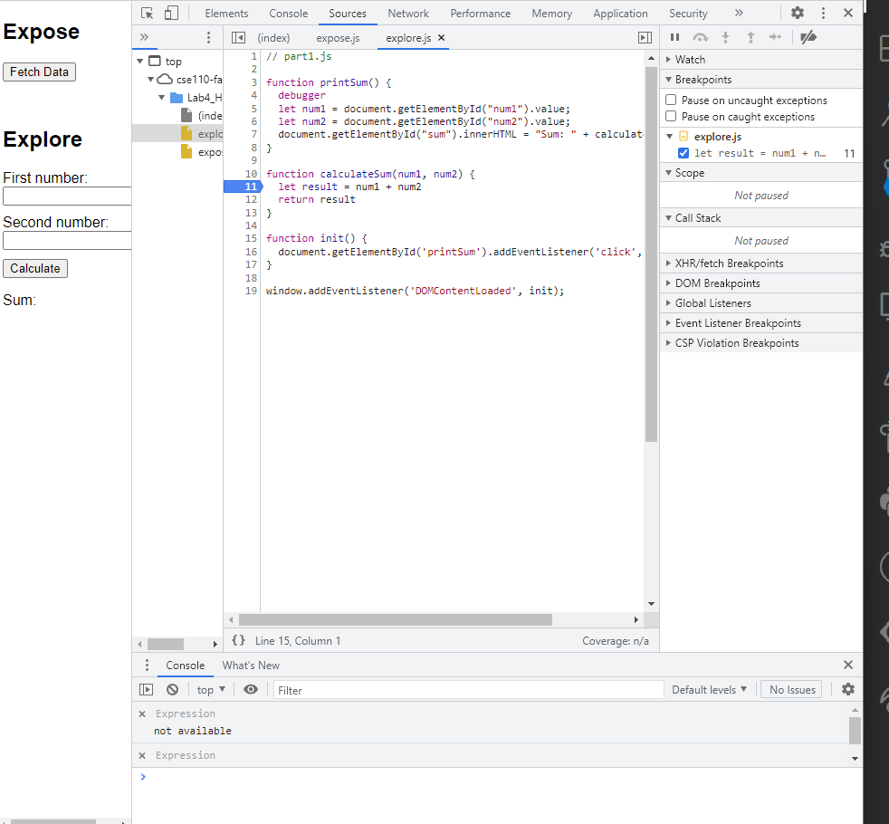

1. the bug was that the two numbers were mapped to strings before "adding", so num2 were appended onto num1, producing a string concatenation
2. the correct fix is use the number method to change the strings to numbers before putting them into calculateSum method 

the other two screenshots:
- 
- 